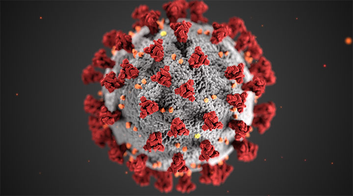

# COVID-19 Healthcare Analysis
## Background 📃

The COVID-19 pandemic has affected us all, globally there have been 99,241,649 cases reported. Currently, the death total is just above one million lives at 1,080,472. COVID-19 related hospital admissions in the United States are 15,142. The total number of vaccinations administered (for ages 5 & up) is currently at 657,927,289, which means appoximately have 68.9% of the US Population have completed their primary series, and only 19.5% have received their Booster Dose.

# Project Objective
Therefore, considering the empirically established trends & correlations provided since the inception of this virus, still in its infancy, our team believes it would be insightful **to study specific key metrics to gain perspective regarding various factors that affect our nation's well being**. In this project, we looked into these aspects.

# Research Questions
We investigated **COVID-19 related data**, conducted **analyses regarding various COVID-19 key metrics**, produced **a set of data visualizations** in order to draw **conclusions** around the following **three questions**:

* What are the top 5 & bottom 5 states across *key metrics*?
	* Which states have really struggled and which have done relatively well in the Unites States across major statistics? 
	* Are there major differences in the extremes between the states or are they relatively similar? 

* Can we compare *various key metrics* from COVID-19 between two selected states? 
	* For example, how do state metrics such as Vaccination Ratio, Weekly New Cases (per 100k), Infection Rate, Deaths, Hospital Beds, COVID-19 ICU Usage in Texas compare to California?

* What is the correlation between *cases reported* and *vaccines administered*?
	* Considering that according to our source, *"vaccines administered"* is the term used when an individual has received at least their initial dose of the COVID-19 vaccination. 
	* What does the *vaccination breakdown* of the total population look like for individuals who have received at least their *initial dose*, up to being considered *"fully vaccinated"* which is classified as having received their 1st & 2nd dose, plus their Booster?

# Methodology (steps/approach)

* Import API Data from Covid Act Now

Created data frame and .csv file for group use

Individually used .csv file to locate appropriate data as it pertained to our questions

Create code to prompt user for input (question #2)

Create supporting visualizations based on the data set

# Analysis Conclusions (need)
insert <.png files> with each speaker's notes
# Presentation

* You can find our presentation slides here https://docs.google.com/presentation/d/1rm7jFHDrNymRFcmqE4Vvx8pv4D9YSr3hyYY9_nEF6Ys/edit#slide=id.g1b0db8f05d9_1_5
# References & Resources (Data Source)

* Act Now Coalition, Covid Act Now. Covid Data API. Retreived December 12, 2022, from https://api.covidactnow.org/v2/states.json?apiKey=
* Centers for Disease Control and Prevention, COVID-19 Response. Weekly United States COVID-19 Cases and Deaths by State (version date: [December] [12], [2022])

## Team members
* Derrick Ngo (GitHub Master)
* Jonathan Arp
* Jesse DeLaCruz
* Tara Ahuja
